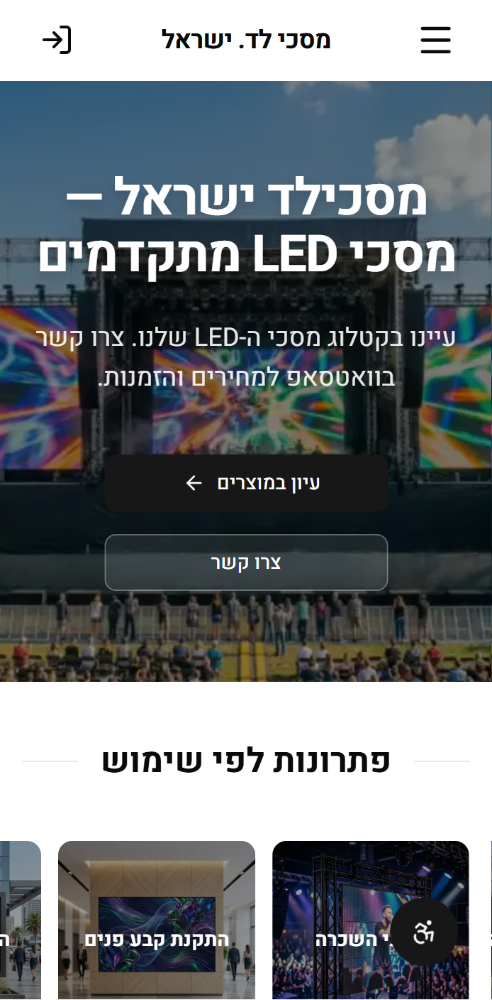

<div align="center">
  <h1>Maskiled Israel</h1>
  <p><strong>LED Screens E-Commerce Platform — Hebrew RTL</strong></p>
  <p>A production Next.js 16 e-commerce platform built and shipped end-to-end for an LED screens vendor. Hebrew-first RTL, custom Supabase-backed CMS, WhatsApp-driven ordering flow, deployed on Vercel.</p>

  <br/>

  <a href="https://xn--7dblffhs.xn--4dbrk0ce/">
    
  </a>

  <br/><br/>

  
  
  
  
  
  
  
  
</div>

---

## Preview

<div align="center">
  <table>
    <tr>
      <td align="center" valign="top">
        
        <br/><sub><b>Desktop · Hebrew RTL</b></sub>
      </td>
      <td align="center" valign="top">
        
        <br/><sub><b>Mobile · Hebrew RTL</b></sub>
      </td>
    </tr>
  </table>
</div>

---

## About

**Maskiled Israel** (מסכילד ישראל) is a production e-commerce platform for an LED screens vendor. Built for Agentical (agentical.agency) as their client's platform — I was the sole engineer on the codebase. The source itself is private — this README is the portfolio-facing summary covering the architecture, engineering decisions, and screenshots that I can share publicly.

The site is Hebrew-only with full RTL support. Instead of a traditional checkout, every product CTA opens a pre-filled WhatsApp conversation with the vendor — chosen deliberately to match how the client actually closes deals.

---

## How This Was Built

**AI-first**: I orchestrate AI coding agents (Claude Code, Codex) through a documented methodology rather than writing every line by hand — the engineering discipline is the point, not the speed.

- **`AGENTS.md` as the single source of truth** — a rules file in the repo defines the architecture, conventions, and hard constraints every agent must obey: money never in floats, Tailwind logical properties only for RTL (no hardcoded `left`/`right`), every admin mutation re-checks role server-side inside the Server Action itself.
- **Guardrail scripts & audit pipelines** — automated checks run on every change (RTL correctness, Server Action authorization, transactional-money rules), so quality is enforced by tooling, not vigilance.
- **The engineer decides, the agent executes** — every schema, content flow, and architectural choice on this page was designed and reviewed by me. Agents accelerate implementation; they never own the design.

The result: one engineer delivering a production system at team-level velocity — with the discipline the decisions below reflect.

---

## Highlights

- **Custom CMS** — every section of the public site (hero, navbar, footer, contact, FAQ, testimonials, projects, theme colors, legal pages) is editable through a purpose-built admin panel; no code deploys for content edits
- **Hebrew-only RTL** with logical-property-only Tailwind (`ms-`/`me-`/`ps-`/`pe-`), Heebo font, and `dir="rtl"` everywhere
- **Server-Components-first** architecture on Next.js 16 App Router with `'use cache'` + `cacheTag()` for public queries, `updateTag()` invalidation in Server Actions
- **Role-based admin** — `owner` / `admin` / `vendor` / `user` with auto-provisioned profile rows via Supabase trigger
- **TipTap rich-text editor** for blog posts and product descriptions, with image upload pipeline into Supabase Storage
- **Drag-and-drop sortable lists** (DnD Kit) for FAQs, testimonials, projects, and category ordering in the admin
- **Custom Supabase image loader** for `next/image`, plus a Sharp-backed `/api/optimize-image` route and client-side `browser-image-compression` before upload
- **WhatsApp deep-link generator** that pre-fills product context — the platform's primary "checkout"
- **Accessibility statement + a11y widget**, sitemap, robots, PWA manifest

---

## Tech Stack

| Layer            | Choice                                                                     |
| :--------------- | :------------------------------------------------------------------------- |
| **Framework**    | Next.js 16 (App Router) + React 19 + TypeScript 5.9 strict                 |
| **Styling**      | Tailwind CSS v4 + shadcn/ui (Radix) + `motion/react` + `next-themes`       |
| **Database**     | Supabase Postgres + Drizzle ORM (schema + migrations)                      |
| **Auth**         | Supabase Auth (email + Google OAuth) with cookie-based SSR (`@supabase/ssr`) |
| **CMS**          | Custom admin panel writing to a JSONB `site_content` table + dedicated tables |
| **Rich Text**    | TipTap editor (admin-side product/blog content)                            |
| **Images**       | Supabase Storage + Sharp + custom `next/image` loader + client compression |
| **Forms**        | React Hook Form + Zod 4 (client) · Server Actions + Zod (server)           |
| **Carousel**     | Embla Carousel (product gallery)                                           |
| **DnD**          | DnD Kit (sortable admin lists)                                             |
| **Icons**        | Lucide React                                                               |
| **Money**        | `decimal.js`, never native floats                                          |
| **Hosting**      | Vercel                                                                     |

---

## Architecture

```
                ┌──────────────────────────────────────────────┐
                │                   Vercel                     │
                │  Next.js 16 · App Router · Node functions    │
                │                                              │
     client ──► │  (marketing) public pages — RSC + 'use cache'│
                │  (auth)      login / register / OAuth        │
                │  (account)   user dashboard + admin CMS      │
                │  /api/*      image optimization (Sharp)      │
                │  proxy.ts    Supabase session refresh        │
                └──────┬─────────────────┬──────────────────┬──┘
                       │                 │                  │
                       ▼                 ▼                  ▼
             Supabase Postgres    Supabase Storage    WhatsApp
             (Drizzle ORM)        (media bucket)      (deep-link CTA)
                       │
                       ▼
                Supabase Auth
                (email + Google OAuth)
```

**Content flow**

1. Admin edits a section at `/account/admin/*` → Server Action validates with Zod → writes to Supabase → `updateTag()` invalidates the cache tag
2. Public pages call cached query functions (`'use cache'` + `cacheTag()` + `cacheLife('hours')`) → served from cache until invalidated
3. If a CMS row is missing or empty, fallback values from `src/config/site.ts` (`DEFAULTS`) keep the page intact

---

## Major Systems

### Hebrew-only RTL
All UI strings live in `src/config/site.ts` (`UI_LABELS`, `DEFAULTS`, `SITE_CONFIG`) — never hardcoded in components. Tailwind logical properties (`ps-`/`pe-`/`ms-`/`me-`/`start`/`end`) only; directional `left`/`right`/`ml-`/`pr-` are banned. Heebo font with both Hebrew and Latin subsets. Radix primitives receive `dir="rtl"` from the layout.

### Custom CMS
Database-backed CMS with two storage shapes:
- **JSONB sections** in `site_content` (one row per section: `hero`, `navbar`, `footer`, `contact`, `final_cta`, `faq_section`, `testimonials_section`, `projects_section`, `products_section`, `categories_showcase`, `theme`, `terms`, `privacy`, `accessibility_statement`, …) with per-section Zod schemas
- **Dedicated tables** for collections (`products`, `categories`, `posts`, `faqs`, `testimonials`, `projects`, `media`)

Adding a new editable section is a five-step recipe: type + Zod schema → query function → page consumer → fallback in `DEFAULTS` → admin route auto-supports editing.

### Product Catalog
Hierarchical categories (self-referencing `parentId`), rich product pages with Embla gallery, JSONB `specs`, `gallery`, and `pricing` columns, and a WhatsApp CTA pre-filled with the product name, slug, and price. `numeric(10,2)` columns + `decimal.js` end-to-end on the money side.

### Auth & Roles
Supabase Auth with cookie-based SSR and Google OAuth. A Postgres trigger (`handle_new_user()`) auto-creates the `profiles` row on signup. Roles (`owner` / `admin` / `vendor` / `user`) are stored on `profiles.role` and gated through two helper layers — `roles.ts` for client-safe checks (`isAdminRole`, `isOwnerRole`, `isVendorRole`) and `get-user-role.ts` (server-only) for the full `{ user, role, profile }` lookup.

### Admin Panel (`/account/admin`)
Owner + admin only. Covers:
- **Content** — every CMS section with a tailored form per shape
- **Theme** — live theme color editor (primary / accent / destructive) generating CSS variable overrides
- **Products + Categories** — full CRUD with TipTap rich text, gallery upload, specs editor, hierarchical category tree
- **Blog posts** — TipTap editor with image upload, excerpt, featured flag, publish toggle
- **FAQs / Testimonials / Projects** — sortable CRUD via DnD Kit
- **Media library** — direct Supabase Storage browser
- **Users** — role management (owner only)

### Image Pipeline
- **Upload**: client-side `browser-image-compression` shrinks before the network hop, server-side validation via Zod, then upload to the Supabase `media` bucket
- **Delivery**: a custom `next/image` loader (`src/lib/cms/image-loader.ts`) routes through Supabase Storage transforms; an internal `/api/optimize-image` route handles Sharp-based fallbacks
- Explicit `width` + `height` on every `<Image>`, WebP preferred

### WhatsApp Ordering
Product CTAs and the global contact CTA route through `src/lib/whatsapp.ts`, which builds a `wa.me` deep link with a pre-composed Hebrew message including product context (name, slug, optional price). This replaces a traditional cart/checkout — the client closes deals over chat.

---

## Engineering Decisions Worth Highlighting

### `'use cache'` with explicit `cacheTag` ownership
Public queries are cached only when there is a clear tag owner that mutations already bust — every Server Action that writes calls `updateTag()` for the affected section. Combined with Next.js 16's component-level cache, marketing pages stream a static shell instantly while CMS-backed regions hydrate from cached queries.

### Server Components first
`'use client'` is reserved for genuine interactivity (gallery carousel, mobile nav, toasts, animations, admin forms). Data fetching, SEO, and static content stay on the server. Server Actions handle every admin mutation with Zod validation at the boundary.

### Server-side access control over RLS for app data
Access control is enforced server-side in Server Actions through the role helpers — RLS is not the primary gate for app tables. This kept the admin UX simple and predictable while still leaning on Supabase Auth for the session itself. Trade-off accepted intentionally; documented in `CLAUDE.md`.

### Centralized animation presets
Framer Motion presets (stagger, fade, hover, etc.) live in `src/lib/animations.ts` — components import named presets rather than inlining keyframes. Keeps motion consistent across hero, product grids, testimonials, and CTAs.

### Light-only theme, dark CSS preserved
Per client preference the live site is light-only, but the dark-mode CSS variables and `next-themes` plumbing are intact so a future toggle is a one-line change.

### Strict content-config separation
All Hebrew copy, defaults, and labels live in `src/config/site.ts` (`UI_LABELS`, `DEFAULTS`) and `src/config/legal-content.ts`. Components import keys, never literals. This makes the CMS overrides and i18n future-proofing trivial.

---

## Performance & Reliability

- `decimal.js` for all financial math; `numeric(10,2)` columns in Postgres
- Public pages use `'use cache'` + `cacheTag()` + `cacheLife('hours')`; admin mutations invalidate via `updateTag()` so edits show up on the next request without a full revalidate
- Image budget: explicit `width`+`height` to avoid CLS, WebP preferred, Sharp-backed server optimization, client-side compression before upload
- Heebo font self-hosted via `next/font` with both Hebrew and Latin subsets
- Sitemap + robots + PWA manifest + accessibility statement out of the box
- Below-the-fold sections deferred where it matters; LCP region (Hero) is intentionally not lazy

---

<div align="center">

**Built by Sagi Menahem**

[](https://github.com/sagi-menahem)
[](https://www.linkedin.com/in/sagi-menahem/)
[](https://sagimenahem.tech)

</div>
